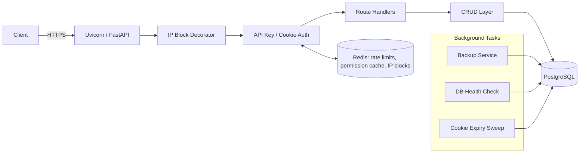

# Clean Database Service

A self-contained **FastAPI + PostgreSQL + Redis** backend that provides authentication, API-key management, user management, rate limiting, IP blocking, automated backups, and database health monitoring out of the box. It is designed as a foundation ("system layer") that application-specific features are built on top of.

> **Status:** Development codebase. No production data, clients, or applied migrations are tied to this repository — it is safe to experiment with, reset, and restructure.

---

## Table of Contents

- [What this is](#what-this-is)
- [Architecture at a glance](#architecture-at-a-glance)
- [Project layout](#project-layout)
- [Requirements](#requirements)
- [Getting started](#getting-started)
- [Configuration](#configuration)
- [Running the service](#running-the-service)
- [Operational scripts](#operational-scripts)
- [Background services](#background-services)
- [Documentation](#documentation)
- [License](#license)

---

## What this is

The service exposes a small, opinionated **system API** for:

| Capability | Description |
|---|---|
| **API keys** | Create, list, patch, and delete API keys with tiered permission levels and per-key rate limits. |
| **Users** | Create, list, patch, and delete user accounts with role-based access, password rotation, and login rate limiting. |
| **Authentication** | Bearer API keys for service-to-service calls, and signed JWT cookies (with server-side revocation) for browser-style sessions. |
| **Abuse protection** | Redis-backed sliding-window rate limiting and automatic temporary IP blocking on abusive bursts. |
| **Reliability services** | Scheduled PostgreSQL backups, a database health checker with optional auto-restore, and expired-cookie cleanup — all running as supervised background asyncio tasks. |

Everything under `src/**/system` is meant to be treated as **infrastructure** — the intent is that new, product-specific functionality is added *alongside* it (new tables, new CRUD modules, new routers) rather than by modifying it. See [`docs/EXPANSION_GUIDE.md`](docs/EXPANSION_GUIDE.md) for a concrete walkthrough.

## Architecture at a glance



Every request to a protected route passes through, in order: **IP block check → authentication/authorization → rate limiting → route handler → CRUD → database**. Rate limits, permission lookups, and IP blocks are all served from Redis so PostgreSQL is only touched on cache misses and writes.

## Project layout

```
config/                 Environment loading (config/loader.py) and service_config.json (tunable knobs)
main.py                 Process entry point; starts logging then the API server
src/
  api/
    app.py              FastAPI app, lifespan (DB init + background tasks), root/test routes
    config.py           Permission level constants
    models.py           Shared Pydantic request/response models
    system/
      api_db_endpoints/ API key admin routes  (/api/db/keys)
      user_db_endpoints/ User admin routes     (/api/db/users)
  models/
    base.py             Declarative dataclass Base with to_dict()/from_dict()
    database.py         Async engine, session factory, with_session decorator
    tables/system/      SQLAlchemy ORM models (User, ApiKey, AuthCookie)
    crud/system/        Async CRUD functions (the only layer that talks to the ORM)
  security/
    tokens.py           API key / password hashing, JWT issuing & verification
    ip_block.py         Redis-backed abusive-IP blocking decorator
    extract.py          Request header/cookie/IP extraction helpers
    validation/         api_security.py, cookie_security.py, password_security.py
  services/
    supervisor.py       Restart-with-backoff wrapper for background asyncio tasks
    system/
      logging.py        Queue + worker-thread logger (console + rotating file)
      backup.py          Scheduled pg_dump backups with retention
      dbhealthcheck.py   Periodic SELECT 1 checks, optional auto-restore-from-backup
      cookieexpiry.py    Periodic revocation of expired JWT cookie rows
      cache/             Redis client, rate-limit cache, permission cache, Lua scripts
migrations/             Alembic migration environment + versions
tools/
  scripts/              One-off operational scripts (bootstrap Postgres/Redis, generate keys, restore backups)
  tests/                Live, end-to-end HTTP test script against a running instance
docs/                   Engineering report, API/DB reference, expansion guide (this deliverable)
```

## Requirements

- Python **3.10+** (developed against 3.12)
- PostgreSQL 13+
- Redis 6+ (Lua `EVAL` scripting support)
- `pg_dump` / `psql` client binaries available on `PATH` (used by the backup and health-check services)

Python dependencies are pinned in [`requirements.txt`](requirements.txt).

## Getting started

```bash
# 1. Clone and enter the project
cd clean-database-service

# 2. Create and activate a virtual environment
python3 -m venv .venv
source .venv/bin/activate

# 3. Install dependencies
pip install -r requirements.txt

# 4. Configure the environment
cp config/.env.example config/.env
# edit config/.env: set real DB/Redis credentials and generate random
# values for API_KEY_PEPPER, PASSWORD_PEPPER, and JWT_SECRET

# 5. Provision PostgreSQL and Redis (Debian/Ubuntu hosts with sudo access)
python3 -m tools.scripts.setup_postgres
python3 -m tools.scripts.setup_redis

# 6. Apply database migrations
alembic upgrade head

# 7. Bootstrap a SUPER_ADMIN API key (required — the API refuses to mint
#    SUPER_ADMIN keys over HTTP)
python3 -m tools.scripts.generate_api_key 4 1000

# 8. Run the service
python3 main.py
```

The API listens on `API_PORT` (default `8000`). Visit `http://localhost:8000/docs` for the interactive OpenAPI/Swagger UI generated automatically by FastAPI.

## Configuration

All configuration is environment-driven via `config/.env` (loaded by [`config/loader.py`](config/loader.py); see [`config/.env.example`](config/.env.example) for the full list of variables) plus tunable operational knobs in [`config/service_config.json`](config/service_config.json) (backup interval/retention, health-check leniency, cache sweep intervals, subprocess timeouts).

Key safety behavior: in any `OPERATING_MODE` other than `development`, the app **refuses to start** (raises `RuntimeError`) if `POSTGRESQL_PASSWORD`, `API_KEY_PEPPER`, `PASSWORD_PEPPER`, `JWT_SECRET`, or `REDIS_PASSWORD` are left at their insecure default values.

## Running the service

`main.py` initializes logging, then calls `start_api_server()`, which runs a single Uvicorn process (`uvicorn.run(app, ...)`) that also owns the asyncio event loop used by all background services. On startup, the FastAPI `lifespan` handler:

1. Verifies database connectivity (`SELECT 1`).
2. Starts the backup, health-check, and cookie-expiry loops (each wrapped in a `TaskSupervisor` that restarts on failure with exponential backoff), if enabled in `service_config.json`.
3. Signals readiness so background services that were started outside the API process can begin.

On shutdown, background tasks are cancelled, the Redis client is closed, and the database engine is disposed.

## Operational scripts

Run all scripts from the project root as modules (they rely on `src`/`config` being importable):

| Script | Purpose |
|---|---|
| `python3 -m tools.scripts.setup_postgres` | Installs, starts, and configures a local PostgreSQL instance and application role/database (Debian/Ubuntu + systemd). |
| `python3 -m tools.scripts.setup_redis` | Installs, starts, and password-protects a local Redis instance. |
| `python3 -m tools.scripts.generate_api_key <level> <rate_limit>` | Mints a new API key directly against the database — the **only** way to create a `SUPER_ADMIN` (level 4) key. |
| `python3 -m tools.scripts.apply_backup <backup_file>` | Restores the database from a specific `backups/*.sql` file (drops and recreates the database first). |
| `python3 -m tools.tests.live_system_api_test` | End-to-end smoke test against a **running** instance; requires `SYSTEM_TEST_SUPER_ADMIN_KEY`. Not a unit test suite. |

## Background services

| Service | File | Enabled via | Behavior |
|---|---|---|---|
| Backup | `src/services/system/backup.py` | `service_config.json:backup.enabled` | Runs `pg_dump` on an interval, keeps the newest N backups (`retention`). |
| DB Health Check | `src/services/system/dbhealthcheck.py` | `service_config.json:dbhealthchecker.enabled` | Periodic connectivity probe; can auto-restore from the latest backup or shut the process down after repeated failures. |
| Cookie Expiry | `src/services/system/cookieexpiry.py` | `service_config.json:cookie_expiry.enabled` | Periodically marks expired `auth_cookies` rows as revoked. |

All three are wrapped by [`TaskSupervisor`](src/services/supervisor.py), which restarts a crashed loop with exponential backoff up to a configurable attempt limit.

## Documentation

Detailed, deep-dive documentation lives in [`docs/`](docs/):

- **[`docs/ENGINEERING_REPORT.md`](docs/ENGINEERING_REPORT.md)** — A critical, category-by-category engineering audit of this codebase against industry practice, including concurrent-user capacity estimates on a $10 VPS.
- **[`docs/API.md`](docs/API.md)** — Full reference for every HTTP endpoint (auth, request/response shapes, status codes).
- **[`docs/DATABASE.md`](docs/DATABASE.md)** — Schema reference, SQLAlchemy conventions, migration workflow.
- **[`docs/EXPANSION_GUIDE.md`](docs/EXPANSION_GUIDE.md)** — How to add new, product-specific features (tables, CRUD, routes) without touching the `system` layer.

## License

[MIT](LICENSE) — Copyright (c) 2026 Nightfall Development Group.
