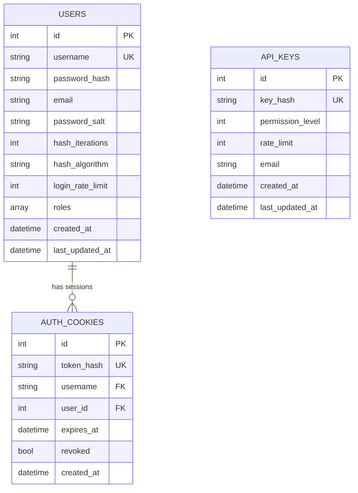

# Database Reference

The service uses **PostgreSQL** via **SQLAlchemy 2.0** (async, `asyncpg` driver) with **Alembic** for migrations. This document covers the schema, the conventions the codebase follows for reading/writing the database, and the migration workflow.

---

## Table of Contents

- [Engine & session configuration](#engine--session-configuration)
- [The `with_session` pattern](#the-with_session-pattern)
- [Schema](#schema)
  - [`users`](#users)
  - [`api_keys`](#api_keys)
  - [`auth_cookies`](#auth_cookies)
  - [Entity relationship diagram](#entity-relationship-diagram)
- [The `Base` model conventions](#the-base-model-conventions)
- [CRUD layer conventions](#crud-layer-conventions)
- [Cache interplay](#cache-interplay)
- [Migrations (Alembic)](#migrations-alembic)
- [Backups & recovery](#backups--recovery)

---

## Engine & session configuration

Defined in [`src/models/database.py`](../src/models/database.py):

```python
engine = create_async_engine(
    DATABASE_URL,                                  # postgresql+asyncpg://...
    echo=(OPERATING_MODE == "development"),
    pool_size=POSTGRESQL_POOL_SIZE,                 # default 10
    max_overflow=POSTGRESQL_POOL_MAX_OVERFLOW,      # default 20
    pool_timeout=POSTGRESQL_POOL_TIMEOUT_SECONDS,   # default 30
    pool_recycle=POSTGRESQL_POOL_RECYCLE_SECONDS,   # default 1800
    pool_pre_ping=POSTGRESQL_POOL_PRE_PING,         # default true
)
SessionLocal = async_sessionmaker(bind=engine, class_=AsyncSession, expire_on_commit=False)
```

All of these are environment-configurable (see [`config/.env.example`](../config/.env.example)). `pool_pre_ping=True` means a dead/stale connection is detected and transparently replaced before use — important on cloud Postgres providers that silently close idle connections.

`init_db()` only verifies connectivity (`SELECT 1`); it does **not** create tables at runtime. Schema is owned entirely by Alembic migrations — run `alembic upgrade head` before starting the app for the first time or after pulling schema changes.

## The `with_session` pattern

Every CRUD function accepts an **optional** `session: AsyncSession | None = None` keyword argument and is wrapped in the [`@with_session`](../src/models/database.py) decorator:

```python
def with_session(func):
    async def wrapper(*args, **kwargs):
        session = kwargs.get("session")
        close_session = False
        if session is None:
            session = SessionLocal()
            kwargs["session"] = session
            close_session = True
        try:
            return await func(*args, **kwargs)
        finally:
            if close_session:
                await session.close()
    return wrapper
```

This gives callers two modes:

- **Fire-and-forget** — call `await get_user_by_username("alice")` with no session; a short-lived session is opened and closed automatically. This is what route handlers do.
- **Explicit ownership** — pass `session=my_session` to compose multiple CRUD calls into **one transaction**. This is used, for example, by `update_user()` and `delete_user()`, which call `delete_auth_cookies_by_username(username, session=session)` using the *same* session/transaction so a user and their cookies are updated atomically.

**When adding new CRUD functions, follow this exact pattern** — accept `session: AsyncSession | None = None`, decorate with `@with_session`, and thread `session=session` through to any other CRUD calls you make internally so multi-step operations stay transactional.

## Schema

### `users`

| Column | Type | Constraints | Notes |
|---|---|---|---|
| `id` | `Integer` | PK, auto | |
| `username` | `String` | `NOT NULL`, **unique** | |
| `password_hash` | `String` | `NOT NULL` | hex digest, PBKDF2-HMAC-SHA256 |
| `email` | `String` | nullable, default `""` | |
| `password_salt` | `String` | `NOT NULL`, default `""` | per-user random salt (`secrets.token_hex(16)`) |
| `hash_iterations` | `Integer` | `NOT NULL`, default `210000` | stored per-user so the global default can change without invalidating existing hashes |
| `hash_algorithm` | `String` | `NOT NULL`, default `"pbkdf2_sha256"` | only `pbkdf2_sha256` is currently implemented |
| `login_rate_limit` | `Integer` | `NOT NULL`, default `10` | login attempts per `LOGIN_TIME_WINDOW` seconds |
| `roles` | `ARRAY(String)` | `NOT NULL`, default `[]` | see note below |
| `created_at` | `DateTime(timezone=True)` | `NOT NULL`, `server_default=now()` | DB-generated |
| `last_updated_at` | `DateTime(timezone=True)` | `NOT NULL`, `server_default=now()`, `onupdate=now()` | DB-generated |

> **`roles` is a Postgres array**, not a normalized join table. `User.role` is a convenience property returning `roles[0]` (or `""`), kept for backward compatibility with earlier single-role code. If your expansion needs role *metadata* (descriptions, permission sets, hierarchies) or efficient large-scale membership queries, plan a migration to a proper `roles`/`user_roles` table — see [Engineering Report §3](ENGINEERING_REPORT.md#3-database-design).

### `api_keys`

| Column | Type | Constraints | Notes |
|---|---|---|---|
| `id` | `Integer` | PK, auto | |
| `key_hash` | `String` | `NOT NULL`, **unique** | `sha256(f"{API_KEY_PEPPER}:{raw_token}")` — the raw token is **never stored** |
| `permission_level` | `Integer` | `NOT NULL`, default `0` | see [permission levels](API.md#permission-levels) |
| `rate_limit` | `Integer` | `NOT NULL`, default `1000` | requests per `RATE_LIMIT_WINDOW_SECONDS` |
| `email` | `String` | nullable, default `""` | free-form label |
| `created_at` | `DateTime(timezone=True)` | `NOT NULL`, `server_default=now()`, **indexed** | |
| `last_updated_at` | `DateTime(timezone=True)` | `NOT NULL`, `server_default=now()`, `onupdate=now()` | |

### `auth_cookies`

Tracks issued JWT cookie sessions so they can be revoked server-side even though the JWT itself is stateless/self-verifying.

| Column | Type | Constraints | Notes |
|---|---|---|---|
| `id` | `Integer` | PK, auto | |
| `token_hash` | `String` | `NOT NULL`, **unique** | `sha256(f"{API_KEY_PEPPER}:{jwt})` (same hashing helper as API keys) |
| `username` | `String` | `NOT NULL`, FK → `users.username` **(`ON DELETE CASCADE`)**, indexed | |
| `user_id` | `Integer` | `NOT NULL`, FK → `users.id` **(`ON DELETE CASCADE`)**, indexed | denormalized alongside `username` for query convenience |
| `expires_at` | `DateTime(timezone=True)` | `NOT NULL` | mirrors the JWT's own `exp` claim |
| `revoked` | `Boolean` | `NOT NULL`, default `False` | set on logout/password-change/role-change/explicit revoke |
| `created_at` | `DateTime(timezone=True)` | `NOT NULL`, `server_default=now()` | |

**Composite index:** `ix_auth_cookies_expires_at_revoked` on `(expires_at, revoked)` — directly supports the cookie-expiry sweep query (`WHERE expires_at <= now() AND revoked = false`) run by [`src/services/system/cookieexpiry.py`](../src/services/system/cookieexpiry.py) every `sweep_interval` seconds (default 60s).

### Entity relationship diagram



Note that `api_keys` has **no relationship** to `users` — API keys are an independent, service-level credential, not tied to a specific user account. This is a deliberate separation: users authenticate as *people* (cookie/JWT), API keys authenticate as *callers/services* (bearer token).

## The `Base` model conventions

[`src/models/base.py`](../src/models/base.py):

```python
class Base(DeclarativeBase, MappedAsDataclass):
    def to_dict(self) -> dict: ...   # {column_name: value, ...} for every mapped column
    def from_dict(self, data: dict): ...  # setattr for every key that matches an attribute
```

All ORM models inherit from `Base` and use `MappedAsDataclass`, which means:

- Models get a generated `__init__` from their `Mapped`/`mapped_column` declarations (order matters — columns with `init=False` are excluded from the constructor, which is why every auto-generated/DB-generated column, like `id` and the timestamp columns, sets `init=False`).
- `to_dict()` is what route handlers use to serialize ORM rows to JSON (e.g., `api_key.to_dict()` in the API-key list route) — **be careful**: it dumps every column, including sensitive ones. There is currently no per-model "public fields" allowlist, so routes that return `to_dict()` output directly must be reviewed to ensure no sensitive column (e.g., a future model with a secret column) is accidentally exposed. `users` routes avoid this by hand-building response dicts rather than calling `to_dict()`.

## CRUD layer conventions

Every table has a corresponding module under `src/models/crud/system/` (e.g. `user_crud.py`, `api_key_crud.py`, `auth_cookie_crud.py`) that is the **only** code allowed to import the ORM model and issue `select`/`update`/`delete` statements for that table. Route handlers and security modules never construct SQLAlchemy statements directly — they always call into a CRUD function.

Conventions to follow when adding a new CRUD module (see [Expansion Guide](EXPANSION_GUIDE.md) for a full walkthrough):

1. One function per operation (`add_x`, `get_x`, `get_xs`, `update_x`, `delete_x`) — avoid one mega-function with many optional flags.
2. Accept `session: AsyncSession | None = None`, decorate with `@with_session`.
3. `await session.commit()` after every write; `await session.refresh(obj)` if the caller needs DB-generated values (timestamps, defaults) back.
4. Log not-found/failure cases with `log_message(...)` at `WARNING` level rather than raising for simple "not found" reads (return `None`/`False` and let the route layer decide the HTTP status).
5. If the table participates in caching (see below), invalidate the relevant cache key(s) on every write path.

## Cache interplay

Two of the three tables have Redis caches sitting in front of hot read paths — **new tables should follow the pattern that fits their access pattern**, not copy one blindly:

| Table | Cached? | Cache key | Invalidated on |
|---|---|---|---|
| `api_keys` | ✅ Permission payload cached in Redis (`permissions:api_key:<hash>`), TTL `REDIS_PERMISSIONS_EX_SECONDS` (default 300s) | `_get_api_permission_payload()` in `api_security.py` | `add_api_key`, `update_api_key`, `delete_api_key` (via `cache_invalidating`) |
| `users` | ✅ Permission payload cached in Redis (`permissions:user:<username>`) | `_resolve_user_permissions()` / `_get_user_permission_payload()` | `add_user`, `update_user`, `delete_user`, `update_user_password`, `update_user_login_rate_limit` |
| `auth_cookies` | ❌ **Not cached** — every cookie-authenticated request queries this table directly via `get_auth_cookie_by_hash()` | n/a | n/a |

The lack of caching on `auth_cookies` is a known gap — see [Engineering Report §7](ENGINEERING_REPORT.md#7-performance). If you build real (non-test) cookie-authenticated routes, consider adding a Redis-cached `{revoked, expires_at, username, user_id}` lookup mirroring the `api_keys` pattern before relying on it at scale.

**Update:** the three previously-independent `cache_invalidating` decorators in `user_crud.py`, `api_key_crud.py`, and `auth_cookie_crud.py` have been consolidated into a single shared implementation in [`src/models/crud/cache_invalidation.py`](../src/models/crud/cache_invalidation.py) — one `cache_invalidating(invalidator)` decorator factory plus identifier-builder helpers (`user_identifier`, `api_key_identifier`, `cookie_identifier`, `password_identifier`, `ip_block_identifier`) sourced from `config/service_config.json`'s `redis_index_prefixes` block (validated via [`config/settings.py`](../config/settings.py)). **If you add caching for a new table, import and reuse `cache_invalidating` and the identifier helpers from `cache_invalidation.py` instead of writing a new variant.**

## Migrations (Alembic)

Configuration: [`alembic.ini`](../alembic.ini) (root) + [`migrations/env.py`](../migrations/env.py).

- `migrations/env.py` imports `Base.metadata` from `src.models.base` and `src.models.tables` (which must import every table module so it's registered on `Base.metadata`) as the autogenerate target.
- The async `DATABASE_URL` (`postgresql+asyncpg://...`) is transparently rewritten to a sync URL (`postgresql+psycopg2://...`) for Alembic's own (synchronous) migration runner — Alembic itself does not run against the async engine.

**Common commands** (run from the project root):

```bash
# Apply all pending migrations
alembic upgrade head

# Generate a new migration from model changes (review the output before committing!)
alembic revision --autogenerate -m "add widgets table"

# Roll back one revision
alembic downgrade -1
```

**When you add a new table or column for your own feature:**

1. Add/modify the SQLAlchemy model under `src/models/tables/` (in your own subpackage — see [Expansion Guide](EXPANSION_GUIDE.md); do not add feature tables under `tables/system/`).
2. Make sure the new table module is imported somewhere that `migrations/env.py` reaches (transitively via `src.models.tables`).
3. Run `alembic revision --autogenerate -m "..."` and **read the generated script** — autogenerate does not reliably detect every change (e.g., check constraints, some index types) and has never had its `downgrade()` path exercised in this repository (see [Engineering Report §3](ENGINEERING_REPORT.md#3-database-design)); test both directions against a disposable database before trusting it.
4. Run `alembic upgrade head` locally, verify, then commit both the model change and the migration script together.

## Backups & recovery

- **Backups** ([`src/services/system/backup.py`](../src/services/system/backup.py)): a background loop runs `pg_dump` on `service_config.json:backup.interval` seconds (default 1800 = 30 min) and retains the newest `retention` files (default 20), stored as plain SQL under `backups/`. **These backups live on the same disk as the live database** — see [Engineering Report §9](ENGINEERING_REPORT.md#9-production-readiness) for why an off-box copy matters before real users depend on this.
- **Manual restore:** `python3 -m tools.scripts.apply_backup backups/backup_<timestamp>.sql` — this **drops and recreates the entire database** before restoring, terminating all active connections first. There is no partial/table-level restore.
- **Automatic restore (`auto_rollover`):** if enabled in `service_config.json`, the health-check service ([`src/services/system/dbhealthcheck.py`](../src/services/system/dbhealthcheck.py)) will automatically drop and restore from the latest backup after `leniency` consecutive failed health checks, always taking a pre-restore safety backup first and quarantining a backup that fails to restore into `backups/bad_backups/`. **This is disabled by default** and is a destructive, last-resort mechanism — read [Engineering Report §6](ENGINEERING_REPORT.md#6-reliability) before enabling it on any database with real data, since it can discard up to one backup interval's worth of writes.
