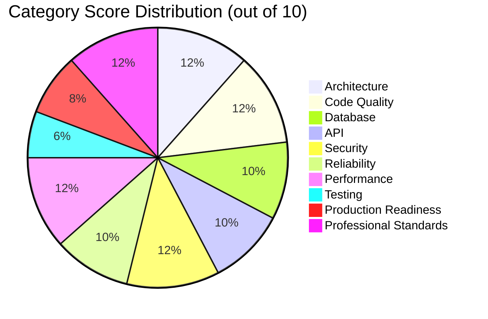

# Engineering Assessment Report

**Project:** clean-database-service  
**Date:** 2026-07-26  
**Scope:** Whole-project assessment against modern industry expectations for backend services (architecture, code quality, database/API/security/reliability/performance/testing/production readiness).  
**Codebase size (approx):** 53 Python files, 0 Alembic migration files in alembic/versions.

---

## Executive Summary

This codebase is **more advanced than hobby code** and shows real systems thinking (auth layers, Redis-backed controls, background services, backup/recovery mechanics). It is also **not production-grade yet** by modern standards due to migration hygiene gaps, testing depth, API contract consistency, and operational safety risks.

**Overall score:** **5.9 / 10**

**Level signal:** **Mid-level engineering output with several senior-level ideas, but critical execution gaps.**

---

## Scoring Matrix

| Category | Score (1-10) | Severity of Gaps |
|---|---:|---|
| 1. Project Architecture | 6 | Medium |
| 2. Code Quality | 6 | Medium |
| 3. Database Design | 5 | High |
| 4. API Design | 5 | Medium |
| 5. Security | 6 | High |
| 6. Reliability | 5 | High |
| 7. Performance | 6 | Medium |
| 8. Testing | 3 | High |
| 9. Production Readiness | 4 | High |
| 10. Professional Engineering Standards | 6 | Medium-High |

### Visual Snapshot

---

## 1) Project Architecture (Score: 6/10)

### What is done well
- Clear top-level layering: API, security, models/CRUD, services, scripts.
- Good use of FastAPI lifespan to start/stop supporting services in one place (src/api/app.py).
- Reusable decorators for cross-cutting concerns (API auth, cookie auth, IP block).
- Task supervision abstraction exists (src/services/supervisor.py).

### What is below industry standards
- Heavy reliance on import side effects for route registration (src/api/system/*/routes/__init__.py).
- Domain boundaries are blurred: security code directly owns rate-limit policy and cache data contracts.
- No explicit dependency-injection/container strategy for shared services (DB, Redis, security policies).
- Operational services are tightly coupled to API process lifecycle (single process = single failure domain).

### What a senior engineer would likely change
- Introduce explicit composition wiring (application factory, dependency modules) instead of side-effect imports.
- Separate core domain logic from transport/auth decorators.
- Move background jobs into dedicated workers or at least isolated supervisors with health endpoints.
- Establish architecture decision records and bounded contexts.

### How serious this is
- **Medium** now, but becomes **high** as feature count grows. Coupling will slow safe change velocity.

### Concrete examples
- Route wiring via module imports: src/api/system/api_db_endpoints/routes/__init__.py, src/api/system/user_db_endpoints/routes/__init__.py.
- Cross-cutting policy logic embedded in decorators: src/security/validation/api_security.py, src/security/validation/cookie_security.py.
- Background services tied to API lifespan: src/api/app.py.

---

## 2) Code Quality (Score: 6/10)

### What is done well
- Naming is generally understandable and intention-revealing.
- Most modules have narrow purposes.
- Type hints are present in many places.
- Logging is consistent in style and readable.

### What is below industry standards
- Type correctness has significant mistakes in core request models.
- Inconsistencies in style and semantics across modules (HTTP method conventions, return payload shape).
- Some functions are too long/complex, especially healthcheck recovery loop.
- Debug/log statements are verbose enough to risk noise over signal.

### What a senior engineer would likely change
- Add strict static analysis (mypy/pyright strict mode) and enforce in CI.
- Introduce lint/format gates (ruff + black or equivalent).
- Break long control-flow functions into smaller testable units.
- Define a stable API response envelope and shared error model.

### How serious this is
- **Medium.** Current quality supports development, but defect risk is higher than needed.

### Concrete examples
- Type mismatches in API model:
  - src/api/models.py: APIRequestData.permission_level typed as str while code sets int.
  - src/api/models.py: APIRequestData.permission_name typed as bool while code sets string.
- Large, complex flow with many branches and side effects: src/services/system/dbhealthcheck.py.

---

## 3) Database Design (Score: 5/10)

### What is done well
- Basic normalization exists for users/api keys/auth cookies.
- Important indexes and uniqueness are present (key_hash, username, composite index for cookie expiry/revocation).
- SQLAlchemy async usage is mostly coherent for CRUD and sessions.

### What is below industry standards
- **No migration history** in alembic/versions (0 migration files) despite Alembic setup.
- Roles stored as ARRAY(String) can be workable, but policy evolution/querying becomes harder than normalized RBAC tables.
- Mixed keying strategy in auth cookies (username + user_id FKs) can create maintenance complexity.
- Limited explicit DB constraints (string lengths, stricter checks) for durable data integrity.

### What a senior engineer would likely change
- Enforce migration-first schema changes (no unmanaged drift).
- Decide and document RBAC model (normalized role tables if growth expected).
- Add DB-level check constraints and field lengths where applicable.
- Audit transaction boundaries and rollback policy.

### How serious this is
- **High.** Missing migration artifacts alone is a major production governance gap.

### Concrete examples
- Alembic configured but no revisions: alembic/env.py, alembic/versions/.
- Role storage and compatibility accessor: src/models/tables/system/user_table.py.
- Auth cookie schema + composite index: src/models/tables/system/auth_cookie_table.py.

---

## 4) API Design (Score: 5/10)

### What is done well
- Request validation via Pydantic is present.
- Permission and rate-limit checks are consistently applied on admin endpoints.
- Route grouping and prefixes are clear.

### What is below industry standards
- REST semantics are inconsistent (e.g., POST used for update on API keys while users use PATCH).
- Endpoint naming is action-oriented rather than resource-oriented in several places.
- No API versioning strategy.
- Error payloads vary in structure (strings vs object details).

### What a senior engineer would likely change
- Standardize methods and resource routes (PUT/PATCH/DELETE semantics).
- Add versioned base path (for example /v1).
- Define uniform error contract and response schema.
- Add pagination/filtering for list endpoints.

### How serious this is
- **Medium.** Clients can still integrate, but long-term API evolution will be painful.

### Concrete examples
- POST update endpoint for API keys: src/api/system/api_db_endpoints/routes/_post_routes.py.
- PATCH used in user updates: src/api/system/user_db_endpoints/routes/_patch_routes.py.
- Non-uniform detail payloads in auth decorators: src/security/validation/api_security.py, src/security/validation/cookie_security.py.

---

## 5) Security (Score: 6/10)

### What is done well
- Good baseline: hashed tokens with pepper, PBKDF2 password hashing with salt + iterations.
- Secure comparison for sensitive values (hmac.compare_digest).
- Startup secret-safety enforcement outside development mode.
- Multiple protective layers: API key auth, cookie auth, rate limiting, IP blocking.

### What is below industry standards
- Custom JWT implementation increases security maintenance risk versus hardened library behavior.
- Cookie auth design has no explicit CSRF strategy beyond SameSite=lax.
- Setup scripts can expose secrets in command invocation/log context.
- Security controls are process-centric and can degrade in distributed deployments.

### What a senior engineer would likely change
- Replace custom JWT implementation with vetted library + claims policy (iss/aud/nbf/jti, key rotation strategy).
- Add CSRF protection pattern for cookie-backed auth workflows.
- Remove plain-text secret leakage vectors in scripts and command logging.
- Add threat-model and security regression tests.

### How serious this is
- **High** if internet-exposed without compensating controls.

### Concrete examples
- Custom JWT encode/decode: src/security/tokens.py.
- Cookie settings and no CSRF token mechanism: src/security/tokens.py, src/security/validation/cookie_security.py.
- Redis setup command includes password argument and command logging: tools/scripts/setup_redis.py.

---

## 6) Reliability (Score: 5/10)

### What is done well
- There is clear intent for self-healing and graceful cleanup.
- Healthcheck, backup, and expiry services are implemented with configurable intervals/timeouts.
- Task supervisor retries with backoff.

### What is below industry standards
- Blocking subprocess operations can run inside async control flows during recovery paths.
- Supervisory exception handling is not comprehensive.
- Rollback behavior around failed DB operations is implicit and not centrally enforced.
- Service orchestration is single-process; one process fault can drop all capabilities.

### What a senior engineer would likely change
- Move recovery operations to isolated worker process/job queue.
- Strengthen supervisor exception boundaries and observability.
- Add transaction rollback wrapper in session decorator.
- Add explicit liveness/readiness probes and crash-loop protections.

### How serious this is
- **High** under failure conditions; moderate in happy path.

### Concrete examples
- Restore path calls blocking subprocess commands from healthcheck flow: src/services/system/dbhealthcheck.py.
- Session decorator lacks explicit rollback on exceptions: src/models/database.py.
- Supervisor catches limited exception types: src/services/supervisor.py.

---

## 7) Performance (Score: 6/10)

### What is done well
- Async SQLAlchemy and async Redis usage are in place.
- Connection pool settings are configurable.
- Redis Lua scripts reduce round-trip logic complexity for cache/rate-limit operations.

### What is below industry standards
- Unpaginated list endpoints can degrade quickly with data growth.
- Extensive per-request logging and auth checks can become hot-path overhead.
- Health/restore code may block event loop during fault handling.
- Potential redundant cache/database lookups in auth paths.

### What a senior engineer would likely change
- Add pagination, filtering, and limits on list resources.
- Add structured sampling for high-volume logs.
- Profile and collapse duplicate lookups in auth flow.
- Ensure all heavy recovery operations are non-blocking to main event loop.

### How serious this is
- **Medium** at current scale, can become **high** with traffic spikes.

### Concrete examples
- List all users and API keys without pagination: src/api/system/user_db_endpoints/routes/_get_routes.py, src/api/system/api_db_endpoints/routes/_get_routes.py.
- Redis eval + DB fallback in auth chain on hot paths: src/security/validation/api_security.py, src/security/validation/cookie_security.py.

---

## 8) Testing (Score: 3/10)

### What is done well
- One end-to-end live system test script exists and covers broad route behavior.
- Test script validates important flows (password rotate, cookie invalidation, rate-limit behavior).

### What is below industry standards
- No visible unit/integration test suite structure with automation runner.
- Live script depends on running infrastructure and privileged key; not CI-friendly by default.
- No deterministic test doubles for Redis/DB behavior.
- No negative/fuzz/security regression matrix.

### What a senior engineer would likely change
- Build layered tests: unit, integration (transactional DB), contract tests, and smoke e2e.
- Add pytest + fixtures + ephemeral services (testcontainers/docker compose).
- Enforce coverage thresholds and pre-merge checks.

### How serious this is
- **High.** Current change risk is significantly under-controlled.

### Concrete examples
- Single live script: tools/tests/live_system_api_test.py.
- No migration-test + no schema drift checks in CI context.

---

## 9) Production Readiness (Score: 4/10)

### What is done well
- Environment-driven configuration is centralized.
- Secret default protection is enforced for non-dev mode.
- Backup + healthcheck + expiry loops show operational awareness.

### What is below industry standards
- No visible CI/CD, deployment manifests, or infrastructure-as-code guidance.
- No migration pipeline despite Alembic setup.
- Monitoring/tracing/metrics are minimal (log-centric only).
- Setup scripts are distro-specific and invoke privileged package operations directly.

### What a senior engineer would likely change
- Add deployment stack artifacts (containers, orchestration, health endpoints, probes).
- Add metrics (Prometheus/OpenTelemetry), dashboards, and alerting.
- Define release process with migrations and rollback runbooks.
- Separate bootstrap scripts from runtime service responsibilities.

### How serious this is
- **High** for real production operation.

### Concrete examples
- No migration revisions: alembic/versions/.
- Linux-specific privileged install scripts: tools/scripts/setup_postgres.py, tools/scripts/setup_redis.py.
- Runtime-only logging system, no metrics emitter: src/services/system/logging.py.

---

## 10) Professional Engineering Standards (Score: 6/10)

### Does this resemble hobby, junior, mid, senior, or production-grade?
- **Best fit:** **Mid-level codebase** with selective senior instincts.

### Signals supporting that conclusion
- Positive senior signals:
  - Defense-in-depth mindset (token hashing, Redis-backed controls, multi-layer auth).
  - Operational concerns included early (backups, health checks, supervisory restarts).
  - Reasonable module decomposition and naming discipline.
- Mid/junior signals holding it back:
  - Missing migration discipline.
  - Inconsistent API semantics and model typing mistakes in central paths.
  - Testing strategy too narrow for safe iterative development.
  - Production hardening and observability incomplete.

### How serious this is
- **Medium-High.** The foundation is promising, but professional maturity is uneven.

### Concrete examples
- Strong: src/security/tokens.py, src/security/validation/*.py, src/services/system/backup.py.
- Weak: src/api/models.py typing errors, alembic/versions empty, limited tests in tools/tests/live_system_api_test.py.

---

## Top 10 Strengths

1. Security-conscious secret handling in non-development mode (config/loader.py).
2. Token and password hashing include pepper/salt and secure comparisons (src/security/tokens.py).
3. Redis-backed rate limiting for multiple surfaces (API key, password, cookie, IP).
4. Modular folder structure with understandable responsibilities.
5. FastAPI lifespan-based startup/shutdown orchestration (src/api/app.py).
6. Backup and healthcheck services indicate operational ownership.
7. Auth cookie revocation model tracks token lifecycle in DB.
8. Composite and uniqueness indexes used for key access patterns.
9. Reusable decorators reduce copy-paste security logic.
10. End-to-end live test script exercises many critical flows.

## Top 10 Weaknesses

1. No migration history despite Alembic integration.
2. Type definition errors in central API request state model.
3. Inconsistent REST semantics and route conventions.
4. Weak automated testing strategy beyond a live script.
5. Blocking subprocess operations in fault-recovery paths.
6. Single-process architecture for API + background jobs increases blast radius.
7. Setup scripts can expose secret values and assume privileged host access.
8. No clear API versioning and weak response contract consistency.
9. Limited observability beyond logs (no metrics/tracing).
10. Potential schema evolution pain from roles-as-array design.

---

## Biggest Concerns

### Biggest architectural concern
- **Single-process coupling of API runtime with operational jobs and recovery flows.** Under severe failure, recovery/maintenance behavior can impact request-serving stability.

### Biggest security concern
- **Custom JWT implementation and cookie session strategy without stronger standards-based hardening (claims policy, rotation model, CSRF posture).**

### Biggest scalability concern
- **Lack of pagination and fully centralized per-request auth checks/logging on hot paths; this will hit throughput and latency sooner than expected.**

---

## Skills To Focus On Next

1. Migration discipline and schema lifecycle management (Alembic-first workflow).
2. API contract design (versioning, consistent error schemas, REST method rigor).
3. Testing architecture (unit/integration/e2e layering and CI enforcement).
4. Production observability (metrics, traces, actionable SLO-based alerting).
5. Fault isolation patterns (worker separation, non-blocking recovery, resilient orchestration).
6. Security hardening with proven libraries and threat-model-driven validation.

---

## Estimated Engineering Level Reflected By This Codebase

**Estimated level: Mid-level (approaching senior in some areas).**

**Why:**
- This is not beginner code. It has genuine operational/security intent, non-trivial async flows, and thoughtful service decomposition.
- It misses senior-level consistency and production rigor in several critical disciplines: migrations, test architecture, API governance, and failure-domain isolation.
- A senior engineer would likely keep much of the core direction, but would significantly harden delivery process and runtime architecture before calling it production-grade.

---

## Suggested Priority Order (Practical Roadmap)

1. Fix type/model correctness defects in API request state models.
2. Establish and enforce Alembic migration workflow with baseline revision.
3. Add pytest-based unit + integration suite and CI gate.
4. Standardize API contracts and introduce versioning.
5. Isolate operational jobs/recovery flows from API serving process.
6. Upgrade auth/session hardening and observability stack.
